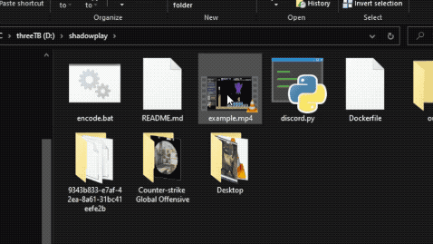

# ffmpeg video conversion for Discord
This repo hosts a Dockerfile and other various scripts that are useful for converting large video files down to less than 8MB, which is the file size limit for Discord.

My personal goal for this software was to reduce the amount of time it takes to go from shouting, "CLIP IT," to actually sharing that clip with my friends on Discord.

Docker Hub: https://hub.docker.com/repository/docker/zachfleeman/ffmpeg4discord

## Usage
The container spins up and executes a Python script that formats an `ffmpeg` command for clip encoding. An example command looks like this:

`docker run --rm -v D:\shadowplay\video.mp4:/usr/app/in/video.mp4 -e codec=vp9 -v D:\shadowplay\out:/usr/app/out/ zachfleeman/ffmpeg4discord:latest`

This command mounts the video file to an "in" directory in the container, and also mounts an "out" directory to the container's encoding output directory. This is where your resultant < 8MB video file will land.

For clipping and slicing video files, follow the guidlines for formatting your file name.

A Batch file for Windows users is included in this repository for simple "drag and drop" functionality, as demonstrated below. You only need to change your "out" directory mount.



## File name formatting
1) `000020.mp4`
    - This clips and compresses the video from 00:00:20 to the end of the file.
2) `000020-000145.mp4`
    - This clips and compresses the video from 00:00:20 to 00:01:45.
3) `SomethingElse.mp4`
    - Compresses the entire video. As long as the first six characters of your file's name aren't all numeric (basically, the first six characters in #1's name), you're good.

## Codec selection
The video codec can be selected by changing the environment variable in your `docker run` command, `codec`, to your desired codec. Currently, the following codecs are supported:

- VP9 (`-e codec=vp9` // This is also the default env variable)
- H.264 (`-e codec=x264`)

## How does this work?
The Docker container starts with a Python script that is a simple flow control process that takes information from the file's name and formats a [two-pass encoding](https://trac.ffmpeg.org/wiki/Encode/VP9) command for `ffmpeg` to execute. To obtain the video file's duration, we use `ffprobe`. WebM is currently the main branch's output container with the VP9 codec.

The ffmpeg command that would be generated by supplying a file with the name `000010-000020.mp4` would look like this (video/audio bitrate varies):

```
ffmpeg -y -i /usr/app/in/000010-000020.mp4 -vf scale=1280x720 \
    -ss 00:00:10 -to 00:00:20 \
    -g 240 -threads 8 -speed 4 -row-mt 1 -tile-columns 2 -vsync cfr \
    -c:v libvpx-vp9 -b:v 1000k -minrate 500k -maxrate 1450k -an \
    -pass 1 -f null /dev/null && \
ffmpeg -i /usr/app/in/000010-000020.mp4 -vf scale=1280x720 \
    -ss 00:00:10 -to 00:00:20 \
    -g 240 -threads 8 -speed 2 -row-mt 1 -tile-columns 2 \
    -c:v libvpx-vp9 -b:v 1000k -minrate 500k -maxrate 1450k -c:a libopus -b:a 96k \
    -pass 2 "/usr/app/out/small_000010-000020.webm" -y
```

This is nothing more than a lot of dead-simple string formatting.